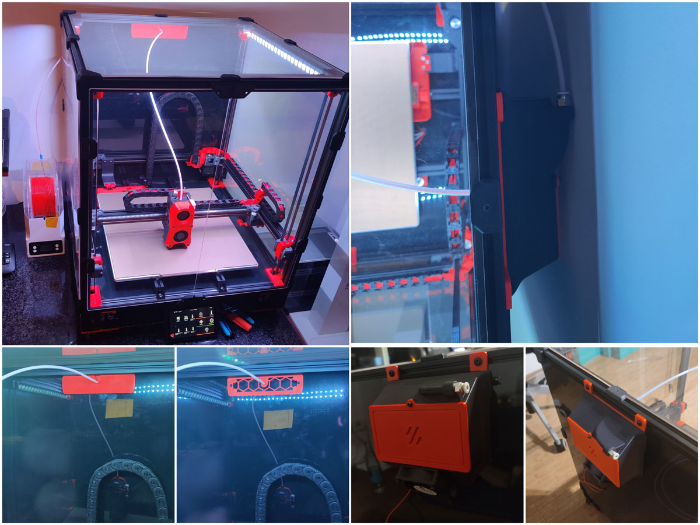
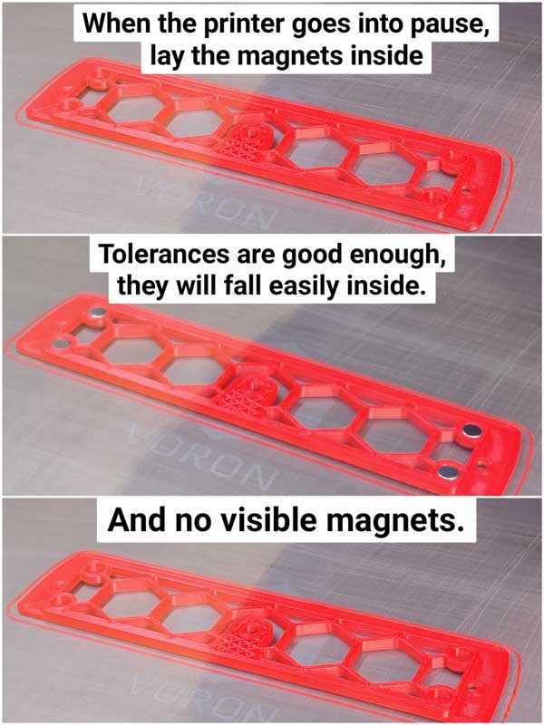
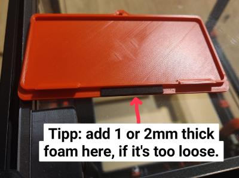

## Exhaust 90° Mod (Guided max angle radius for smooth filament sliding)
##### Credits:
- Voron-Team: Its the default 2.4 Exhaust, but modified!
- @falo2k: [Magnetic Grill Cover](https://github.com/VoronDesign/VoronUsers/tree/master/printer_mods/falo/magnetic_grill_cover "Magnetic Grill Cover") (Awesome guy, my Grill+Cover is exactly his Grill+Cover, only with a recessed filament hole, to match the Exhaust 90° Mod.) So all credits to him!

###### Printing:
- Default voron settings, correct orientation, no supports needed!

###### Bom:
- 6x M3 heat inserts
- 4x M3x25 SHCS (Fan Screws)
- 2x M3x8 BHCS (Grill Screws)
- 4x 6x3 Magnets (Grill)
- 4x 6x3 Magnets (Cover)
- Foam Tape, please check falo2k for this [Magnetic Grill Cover](https://github.com/VoronDesign/VoronUsers/tree/master/printer_mods/falo/magnetic_grill_cover "Magnetic Grill Cover")
- PTFE Tube (3mm ID / 4mm OD)
- 2x [Mount Pieces](https://github.com/VoronDesign/Voron-2/blob/Voron2.4/STLs/VORON2.4/Exhaust_Filter/%5Ba%5D_exhaust_filter_mount_x2.stl "Click Me")

###### Description:
- Exhaust Mod with as less as possible ptfe tube bending. The ptfe tube is guided. I highly recommend an 4mm OD and 3mm ID ptfe tube. But all other ptfe tubes fits either. The magnetic cover parts are a nice touch.
- Housing: Only modified for better printability. So no supports needed and it's easy printable. You don't have to use this whole set. The housing is compatible with all "default" voron parts (grill + rear cover)
- Grill: Modified version of @falo2k magnetic grill, the magnets gets thrown in during the print (more to that later), so they are invisible. The ptfe output hole is slightly recessed (it's 2mm below the original position) to match the "housing".
- Cover: Slightly modified version of @falo2k, same here, ptfe tube output 2mm below original position, so this version matches the housing.
- Rear Cover: Slightly modified original voron rear cover. You absolutely don't need this if you have one already. It's just modifyed for better printability (less overhangs). The logo in the back and that design "square" thingy is slightly deeper and angled a bit. So it looks more beautiful if you print it and wont have the hanging layer lines inside the logo. So this is just a "better printability" modification.
- Mount pieces: Take it simply from Voron github under stl's, i just mention this at all for completeness. [Click Me](https://github.com/VoronDesign/Voron-2/blob/Voron2.4/STLs/VORON2.4/Exhaust_Filter/%5Ba%5D_exhaust_filter_mount_x2.stl "Click Me")
- Tipp: If the rear cover is a bit loose in the housing, you can add a bit foam (see pic below), then it will sit perfectly in the housing.

###### Grill How-To:
- If you use a 0.2 Layer hight, then simply open your gcode file and search for Layer 19. Add there simply "PAUSE" under the commenting layer 19 line. (In Cura for example, you have to search for "LAYER:19" and add simply "PAUSE" one line below)
- If you use another layer hights, please check in your slicer for the right layer, before the holes get closed.
- Then you simply print it, till the printer pauses. Throw the magnets in, as fast as possible. The orientation doesn't matters much because you can do it correctly later on the cover part.
- HINT: If you wait too long, your nozzle will ooze and this filament will be missing in the resume process. (Means the one layer will miss a small part of infill or in worst case, wall line) (But it's not dramatic, it will still look good, just not perfect).
- Lets say you have 5-10 seconds time, to drop in the magnets. You don't have to press fit them, the holes are bigger, so they will fall inside. Then Resume your print!
- As Tipp: Mainsail shows the actual printing layer in the status, so you don't have to sit near your printer and monitor it. And you know roughly when the printer will pause.

###### Pictures:

