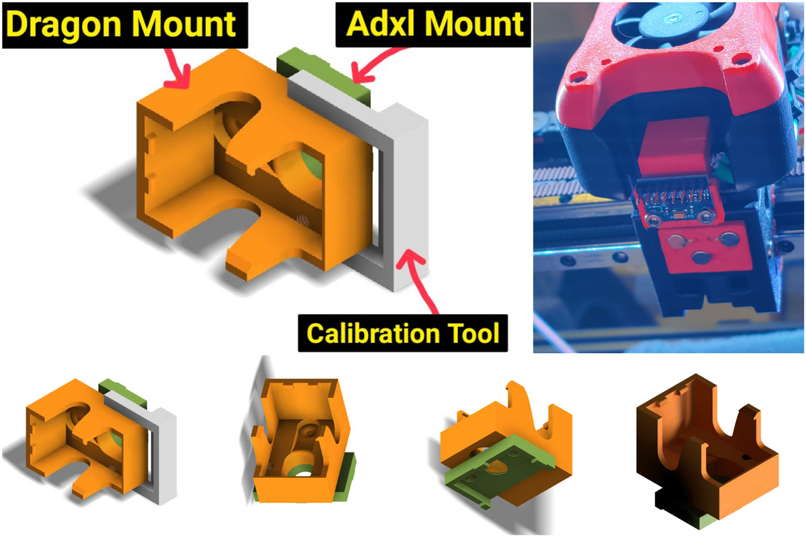

## Adxl Mount Heatblock (Dragon Version)

##### Credits:
- @tzeman: https://www.thingiverse.com/thing:4897289 (V6 Plug)
- He inspired me for this Dragon Version!

###### Printing:
- Tolerances are very tight, print only with calibrated flowrate
- To be safe, scale it to 100.5% in all dimensions. (It's designed to be scaled between 99 & 102%)
- Default voron settings, correct orientation, no supports

###### Bom:
- 2x M3x8
- It's designed for M3x8, but M3x6 will work too

###### Description:
- Compatible and tested with Trianglelab & Dragon Hotend. (Both tested)
- This mount sits extremely snug on the heatblock. No downsides to screwing adxl mount solutions.
- There is no need to unscrew the nozzle. All you need todo is removing the silicone sock and plug in the adxl.
- There is an centration tool. Let me say, it's not really needed, but helps to centrate the adxl better, so y calibration doesn't influences x axis and opposite.

###### To-Do:
- Updated version, that is not tolerance dependent and will fit perfectly without calibrated flowrate or scaling.

###### Pictures:

