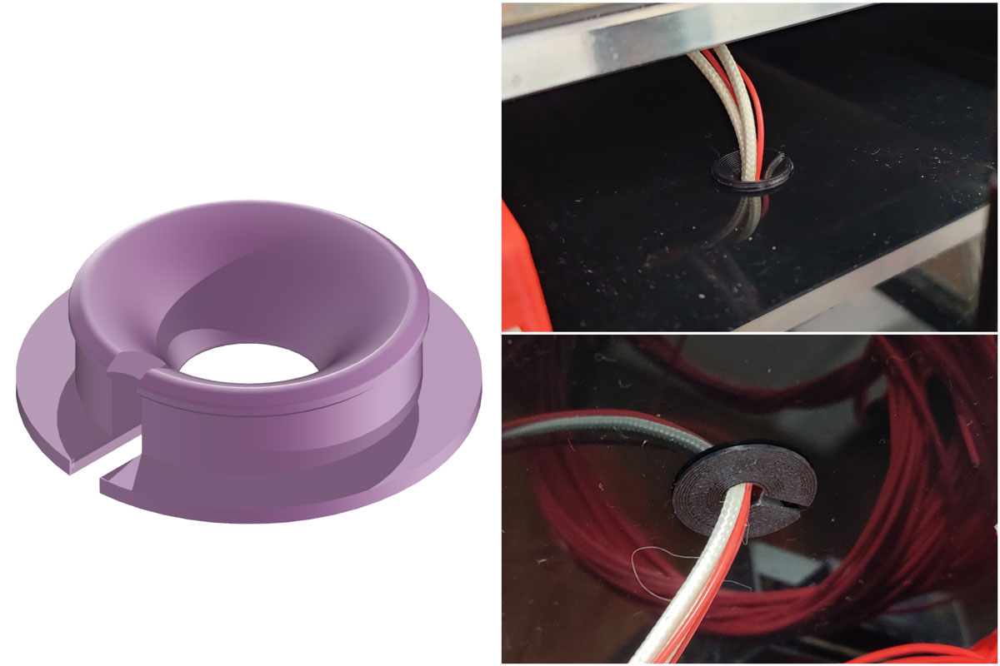

## Buttom Plate Bedhole Plug
##### Credits:
- Everyone that can draw a Circle :-)

###### Printing:
- Default voron settings, correct orientation, no supports

###### Bom:
- Nothing

###### Description:
- It's by default for Ø15mm hole on a 3mm plate, but you can simply scale it in your slicer to your needs.

###### Pictures:

