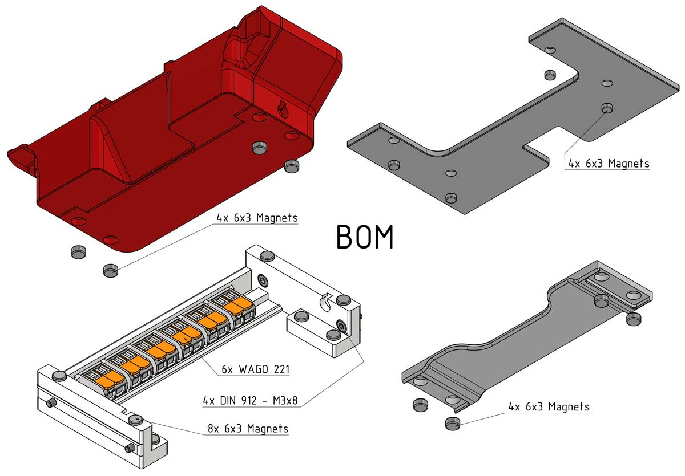
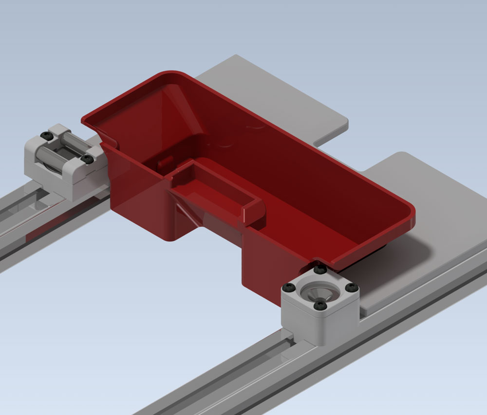
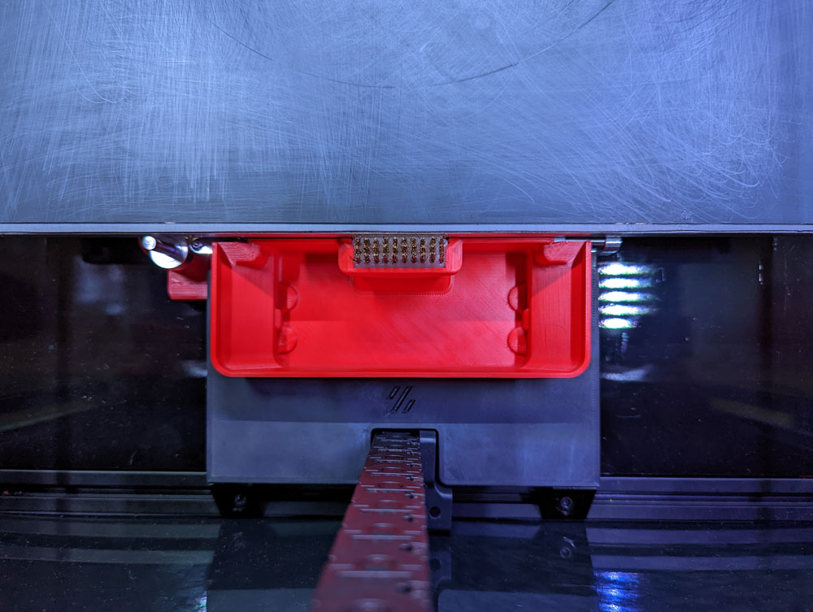
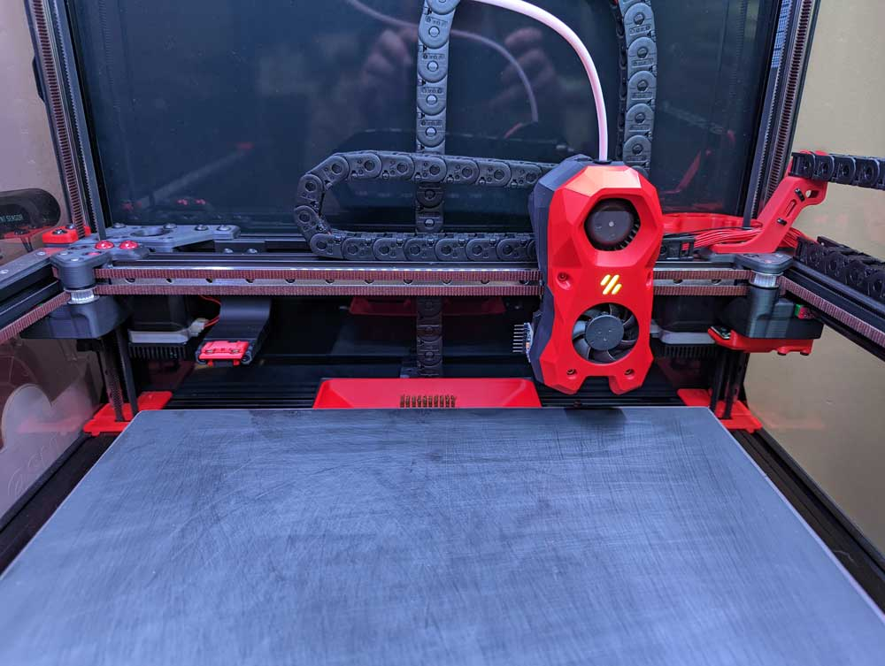
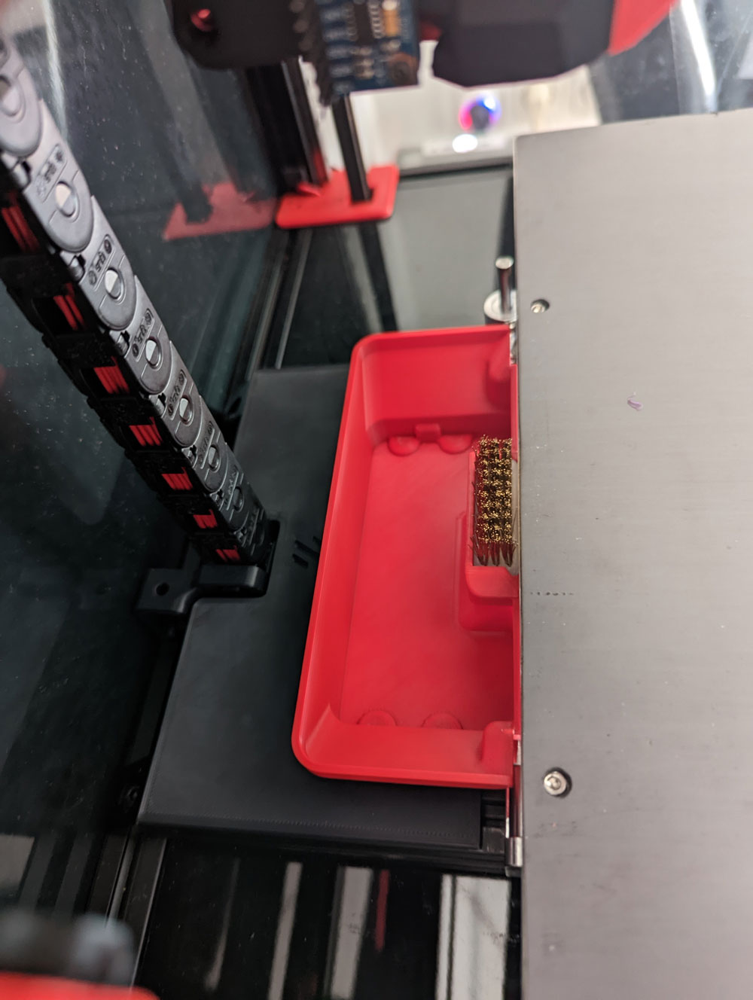

## Changelog:
Release (24.07.22): Release!

  

    Old Changelog
  

- Nothing yet.

#

## Videos:
Remove Bed: https://youtube.com/shorts/P7dfdtHAS0U 
Mount Bed: https://www.youtube.com/shorts/KiGKaBCcbPg 
Bucket: https://www.youtube.com/shorts/od5NZhmdGk4 

#

#

  

    CREDITS: Midnite3DP, Mandalaroseworks & all the great people we have in our community :-) 
  

* Midnite3DP: <a href="https://github.com/Midnite3DP/voron-bedpan">Original Bedpan</a>, Thank you very much for the Idea!!! It's basically his work just with a lot modifications, cableholder and a new bucket :-) 
* Mandalaroseworks: Thanks guys for making that amazing Kinematic Mount! Without you, this won't be possible! 
* Community: Feelingwise discord is a Place filled with only nice and always helpful People! A special thanks to all of them, i personally just love everyone there! 

  

    Print Settings:
  

- Default Voron settings, correct orientation, no supports needed! 

  

    BOM:
  

- 20x 6x3 Magnets! 
- 4x M3x8 SHCS - DIN 912 
- 6x WAGO 221-412 

  

    Description:
  

- Get the Power of your Kinematics mount! Easy removable and mountable bed and Bucket! 
- There is not much to say, watch simply the Video! 
- Klicky/KlickyNG/etc Compatibility! I thought about that and you can drive fully over the bucket at Z0 with klicky attached without to worry about!

## Pictures:

