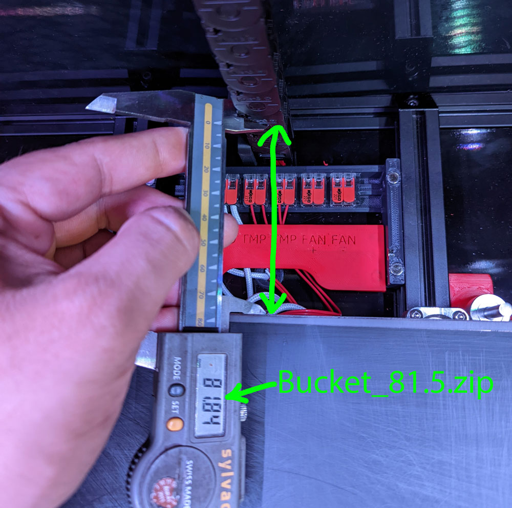

## Howto:
- Measure the distance from the Chain to your Bed and round to the next smaller Value!
- As an orientation point, i am using Bucket_82.zip
- For the Bucket only, i am using Polylite ASA and my Bed has always 115c! My bucket is touching the Bedplate!
- If you print with Low Heat resistant Filament, leave a gap of 0,5mm!
- By design, there will always be a gap! Because only the brush should touch the bedplate. The Brush is very heat resistant!

## Pictures:

