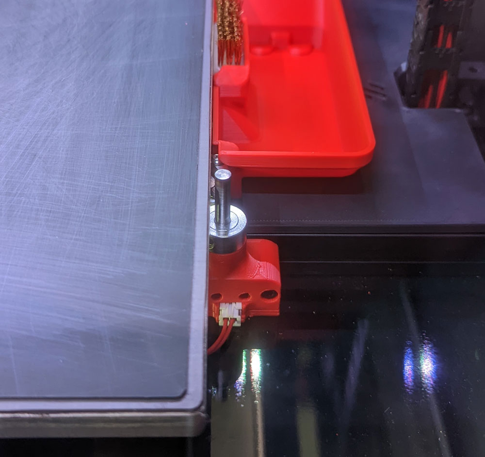
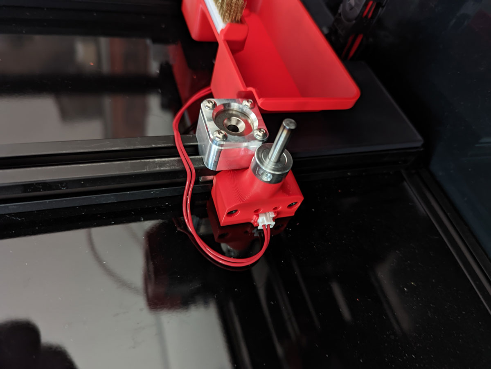

## Changelog:
Release (24.07.22): Release!

  

    Old Changelog
  

- Nothing yet.

#

#

#

  

    CREDITS: Voron-Team & all the great people we have in our community :-)
  

* Voron-Team: Yeah, without you Guys, nothing were possible here :-) 
* Community: Feelingwise discord is a Place filled with only nice and always helpful People! A special thanks to all of them, i personally just love everyone there! 

  

    Print Settings:
  

- Default Voron settings, correct orientation, no supports needed! 

  

    BOM:
  

- 1x <a href="https://de.aliexpress.com/item/1926553469.html?spm=a2g0o.order_list.0.0.79315c5fzU5aLH&gatewayAdapt=glo2deu">Big Microswitch Without Lever NC</a> 
- 2x M2x12 BHCS - ISO 7380 
- 3x M2x10 Self Tapping 
- 2x M3x20 SHCS - DIN 912 
- 1x JST-XH 2PIN Male 
- GT2 20T Pulley (5mm ID 10mm W) 
- 1x 37.5 x 5mm pin - For 9mm thick MRW BED 
- 1x 38.5 x 5mm pin - For 8mm thick Generic BED 

  

    Description:
  

This is a Z-Endstop for a Bed with MRW Kinematics 
This Endstop requires more Force as the normal Voron Endstop. It has the benefit of: 
1. Much less risk that the Pin stucks! 
2. Nozzle need to trigger the Pin with more Force, means oozing will be less of an issue! 
3. Fits perfectly a Kinematics Bed without having an extremely long Pin that wiggles! 

## Pictures:
 
