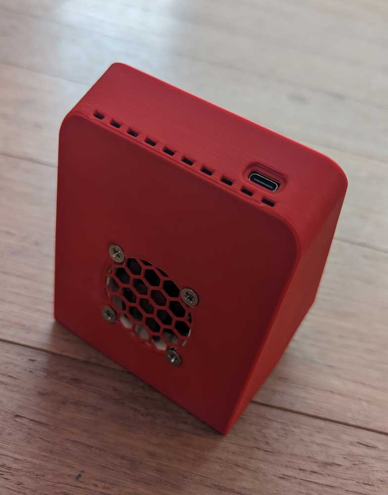
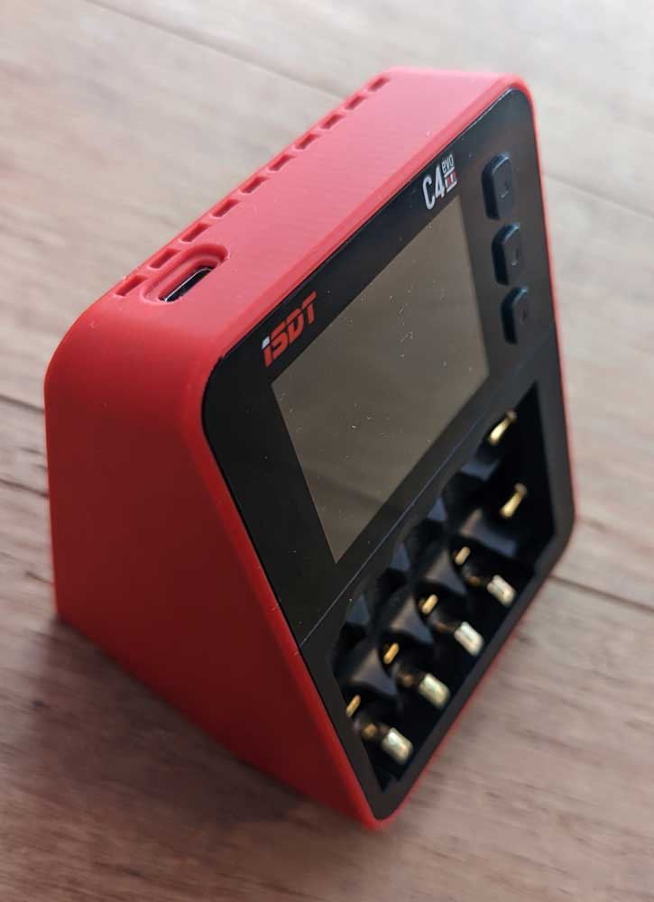

<h1 align="center">ISDT C4-Evo Noctua Mod</h3>

 

  

   Changelog: Release (12.09.22): ISDT C4-Evo Noctua Mod
  

- Nothing Yet!   

#
 

  

    Why? Because there is a version available that costs money, is shitty printable and needs supports... I can do it simply better.
  

#
 

  

    Print Settings:
  

- Default Voron settings, correct orientation, no supports needed! 

#
 

  

    BOM:
  

- 1x Noctua A4x10 3-Pin 5v 

#
 

  

    Description:
  

- How to open the ISDT C4? 
- The Answer is very easy if you know how :-) 
- There is a 1mm thin plastic shield glued to the screen, take a thin screwdriver put it from the side underneath and you can easy hower that screenprotector off! 
- 2 Screws are under the screen itself, simply rotate, the screen will fall off and you will see the screws. 
- The other 4 screws are easy to spot. 
- You don't need anything for this mod, other as an Noctua Fan!  

#

 
 

#
