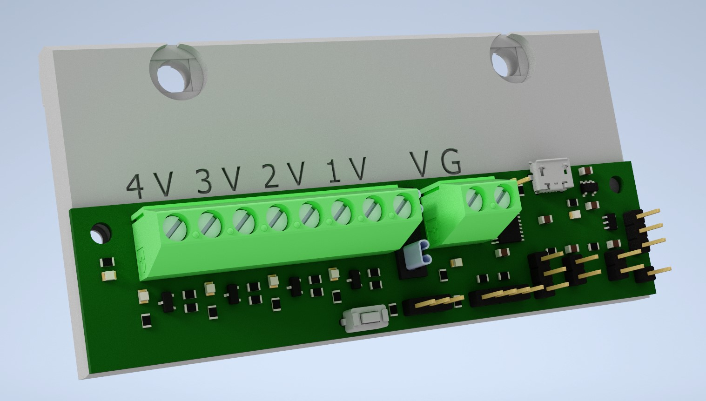
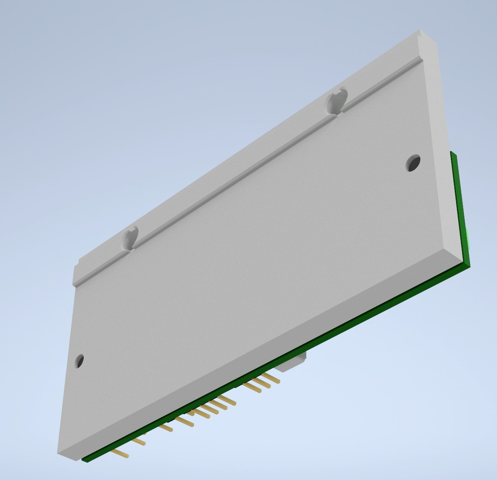
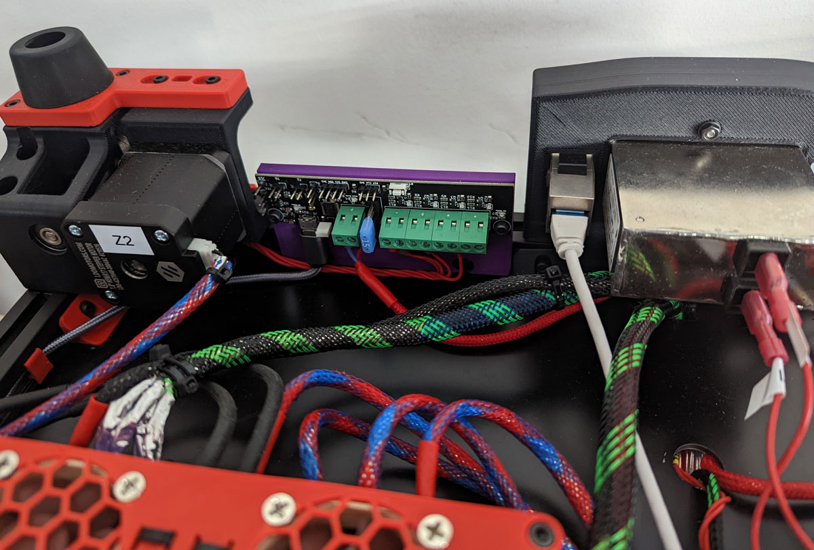

## Changelog:
- Release (11.09.22): KEEM

  

    Old Changelog
  

- Nothing Yet!   

#

## CREDITS: Timmit for the Klipper Expander!

  

    Print Settings:
  

- Default Voron settings, correct orientation, no supports needed! 

  

    BOM:
  

- 2x M3x8 SHCS 
- 2x M5x8 SHCS 
- 2x M5 T-Nuts 
- 2x M3-Inserts 
- 1x Klipper Expander 

#

 
 
 

#
