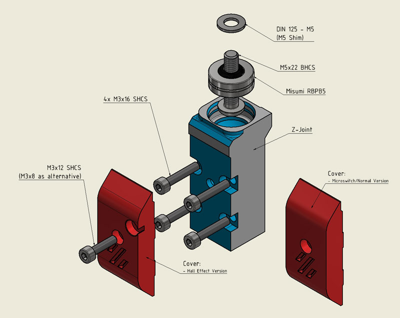
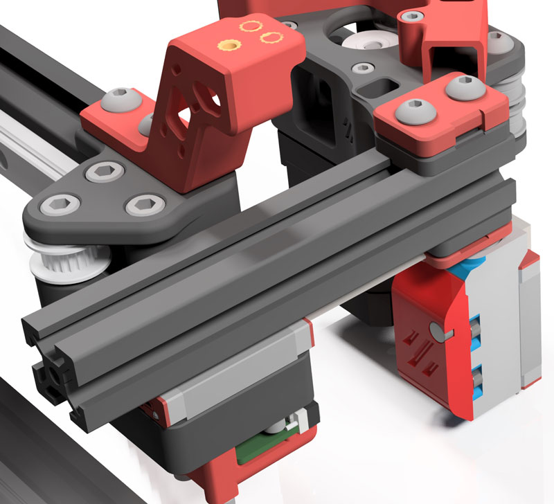
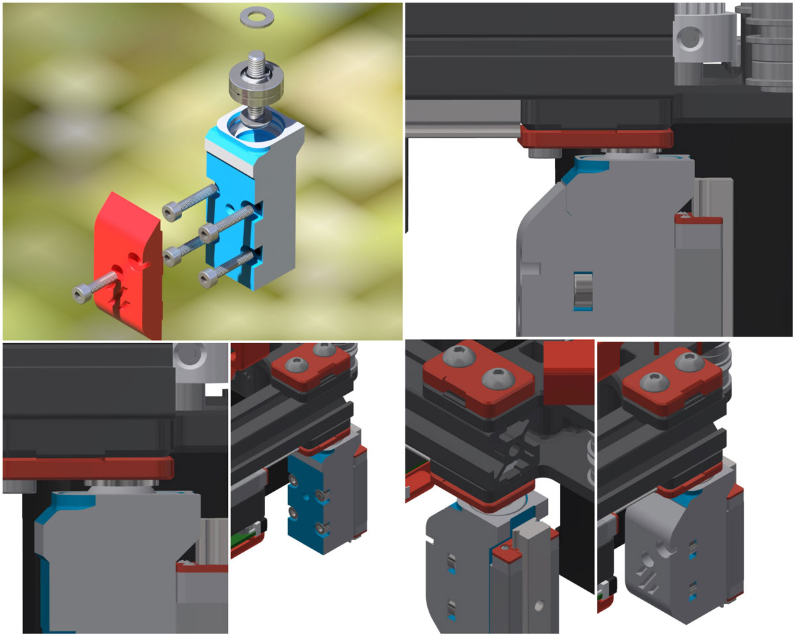
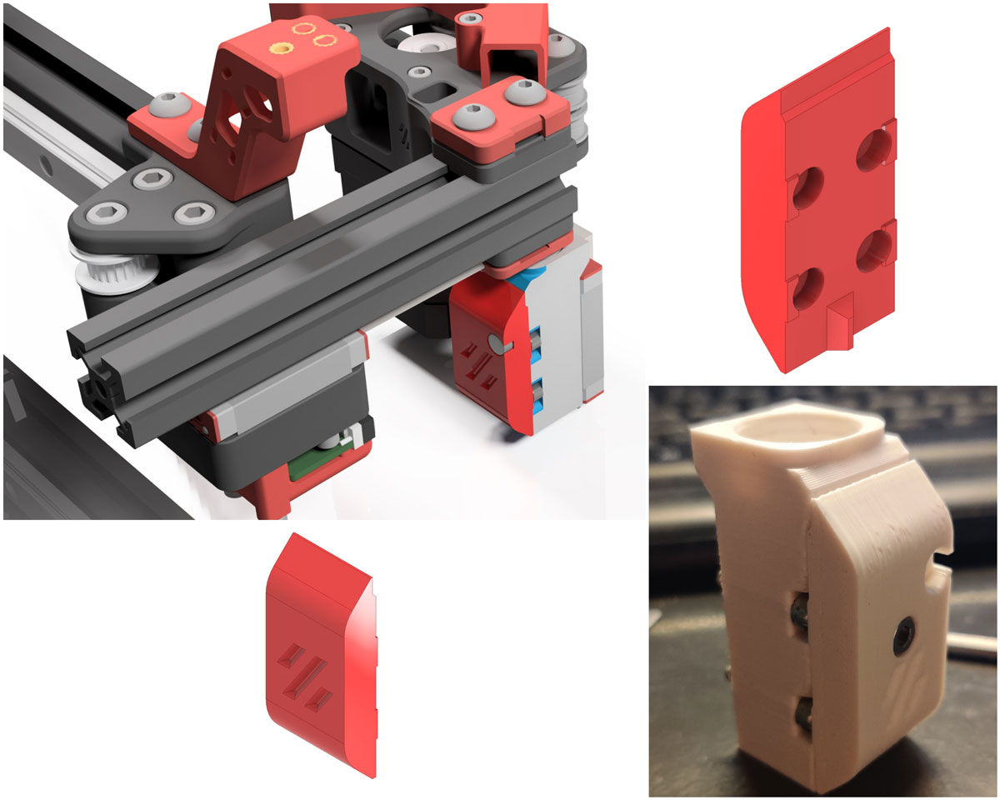
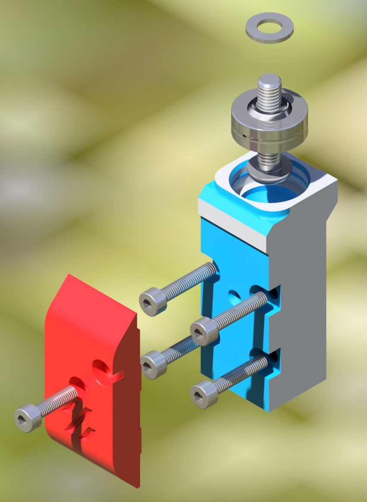

# UPDATE
- 23.03.2022: Made the tolerance for the Z-Joint (Inventor Ipt file) parametric and added a version with 0,15mm tolerance for the RBPB5 Bearing!
- 27.09.2021: Final Release of CAD & STL Files! Please keep in mind that i need to update descriptions. The BOM is still correct!
- Please keep in mind, i didn't updated the pictures, the Z-Joints are looking a bit different now!

## Misumi RBPB5 (Gucci GE5C)
##### Credits:
- @hartk1213 [Original GE5C Mod](https://github.com/hartk1213/MISC/tree/main/Voron%20Mods/Voron%202/2.4/Voron2.4_GE5C "Original GE5C Mod") (He has too much nice things, please visit his Github Page)
- His Design is made for GE5C and Igus ELGM-05
- He inspired me for this here and many more things :-)

###### Printing:
- Default voron settings, correct orientation, no supports needed!

###### Bom: (Multiply with 4 for all corners)
- 1x Misumi RBPB5
- 1x DIN433-M5 (Shim) (DIN125 will work either, but DIN433 are slightly smaller shims, those allow more tilting!)
- 1x M5x22 (BHCS/ISO 7380)
- 1x M3x12 SHCS
- 4x M3x16 SHCS
- 4x 6x3 Magnets (Magnetic Version)

- The M5x22 doesn't exists. So buy an M5x25 and grind it down to 22! Optionally (i recommend) to thind the screwhead down to 8-8.5mm diameter, this will allow more tilting! Simply put the screw on your drilling machine, turn it on and use a drehmel to grind the head down. Its easy!

###### Description:
- The whole reason for this is, that GE5C bearings have some play in them. Igus ELGM05 are a lot better, but i wanted something Gucci and even stiffer with more tilting.
- Misumi mentions in the specsheets max 0,035mm axial play. Igus and GE5C have no axial play specifications. (But igus have actually no play)
- This means for me, that with some Grease (Mobilux EP1/EP2), should remove almost all play and the uneven Gantry (it will always press the bearings outside/inside), will do the rest.

###### Update:
- After a lot of iterations and a lot of headaches, its finally done. Now i can finally tell the difference, why you probably want to do this either: you will get a lot stiffer gantry that is able to tilt freely.
- ADXL tests will follow, need to fix my printer first again, my accelerations made some screws and inserts falling out xD 

###### Pictures:

