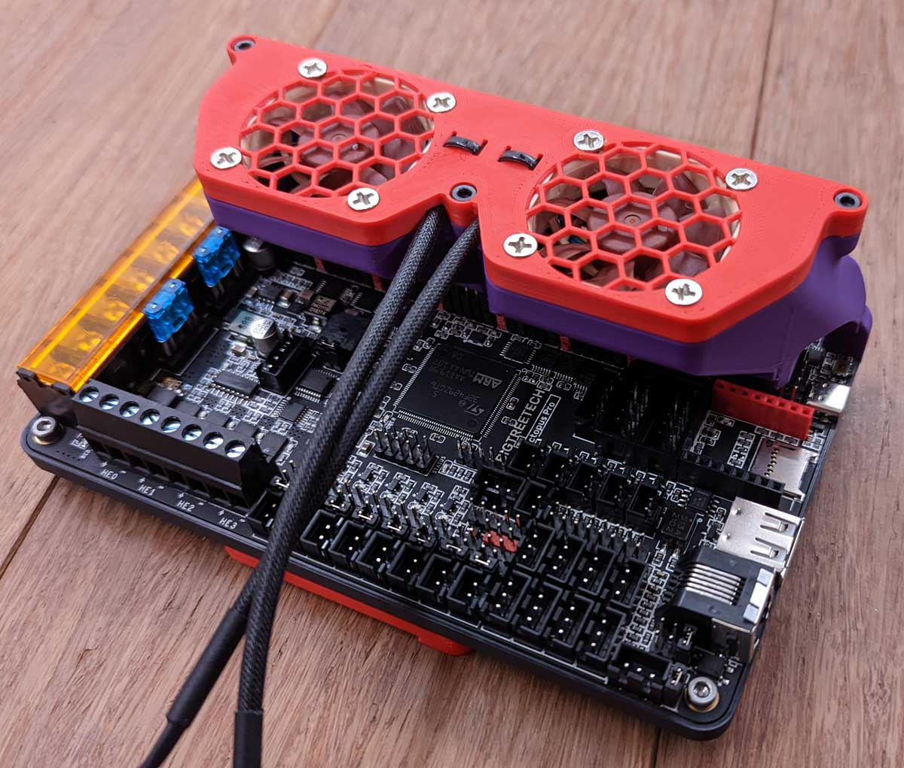
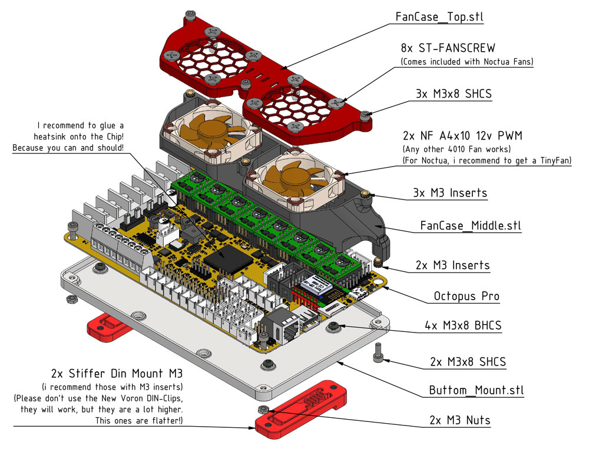

<h1 align="center">Octopus Pro FanCase aka Octoglasses</h3>

 

  

   Changelog: Release (11.09.22): Octoglasses
  

- Nothing Yet!   

#
 

  

    CREDITS: Voron-Team for the Din-Clips & Gi7mo! for <a href="https://github.com/Gi7mo/TinyFan">TinyFan</a>!
  

* Voron-Team: Yeah, without you Guys, nothing were possible here :-) 
* Gi7mo!: Big thanks to you for the TinyFan! It's like a must have for this Project! 
* Community: Feelingwise discord is a Place filled with only nice and always helpful People! A special thanks to all of them, i personally just love everyone there! 

#
 

  

    Print Settings:
  

- Default Voron settings, correct orientation, no supports needed! 

#
 

  

    BOM:
  

- 7x M3x8 SHCS 
- 4x M3x8 BHCS 
- 2x M3 Nuts 
- 5x M3-Inserts 
- 2x <a href="https://github.com/Ramalama2/Voron-2-Mods/tree/main/Stiffer_DinMount">Stiffer DIN Mount M3 (Insert)</a> 
- 2x Noctua NF A4x10 12v PWM (Any Other 4010 12v Fan is fine either) 
- 8x ST-FANSCREW (Comes with Noctua Fans already) 
- 1x Heasink for the STM32Fxxx Chip 
- 1x <a href="https://github.com/Gi7mo/TinyFan">TinyFan</a>, you can get one from Gi7mo! in Germany. I highly recommend one for Noctua Fans! 

#
 

Assembly: <a href="./Manual.pdf">Manual PDF</a> or <a href="./Manual/">Manual Images</a>

- <a href="./Manual.pdf">Manual as PDF</a> 
- <a href="./Manual/">Manual as Images</a>

#
 

  

    Description:
  

- Why: 
- The 5160 Pro Drivers are getting extremely hot! You need to cool them! 
- I highly recommend the <a href="https://github.com/Gi7mo/TinyFan">TinyFan from Gi7mo!</a> 
- The FanCase has Cablehole exits at the back, for the TinyFan. 
- You don't need it, but its amazing for Noctua fans to see RPM and control those Correctly with a PWM signal. 

#

 
 

#
