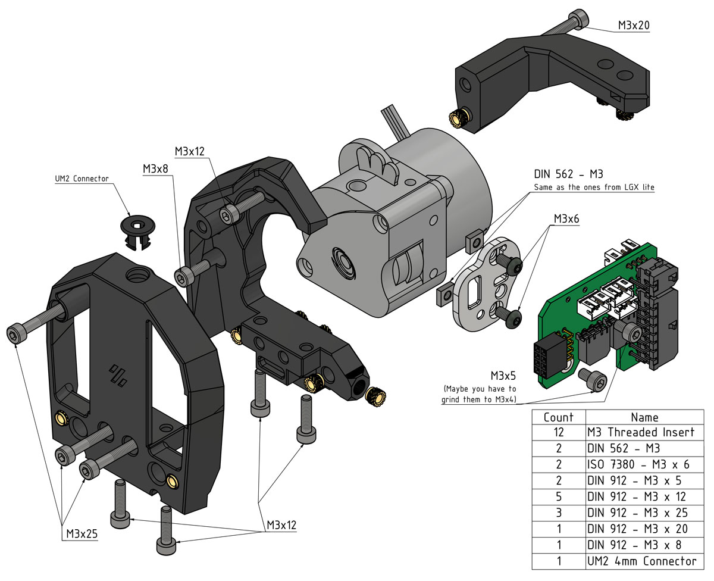
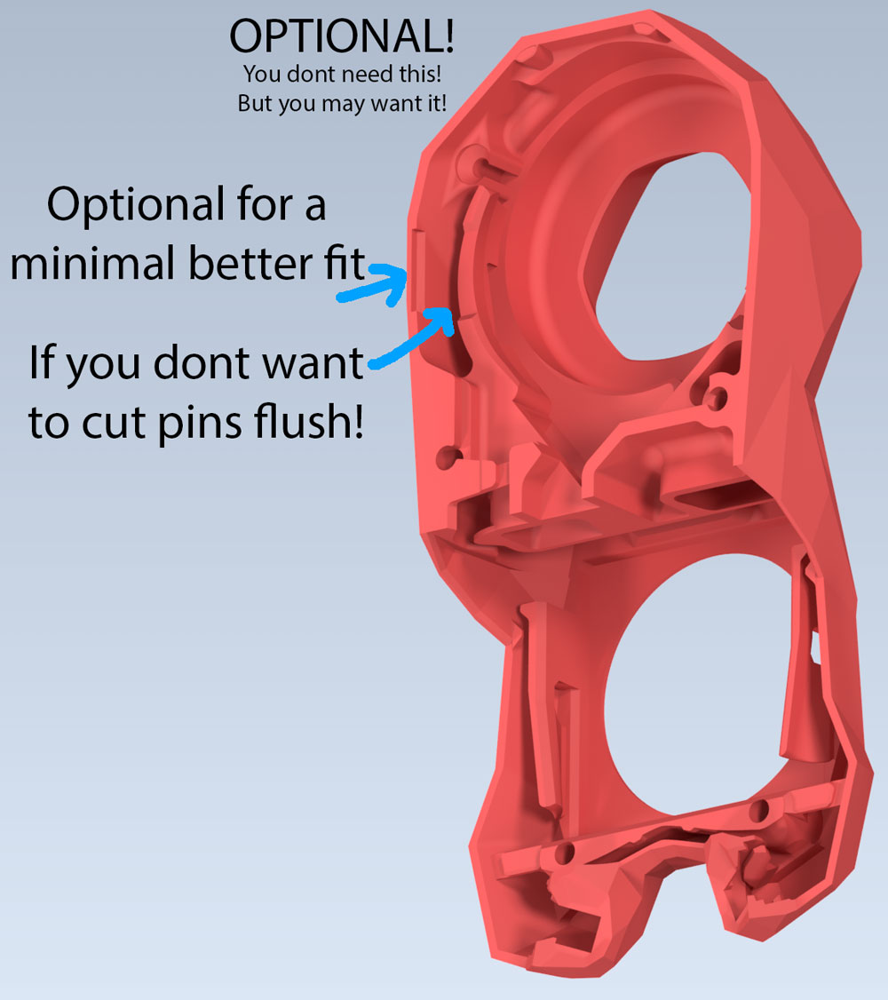
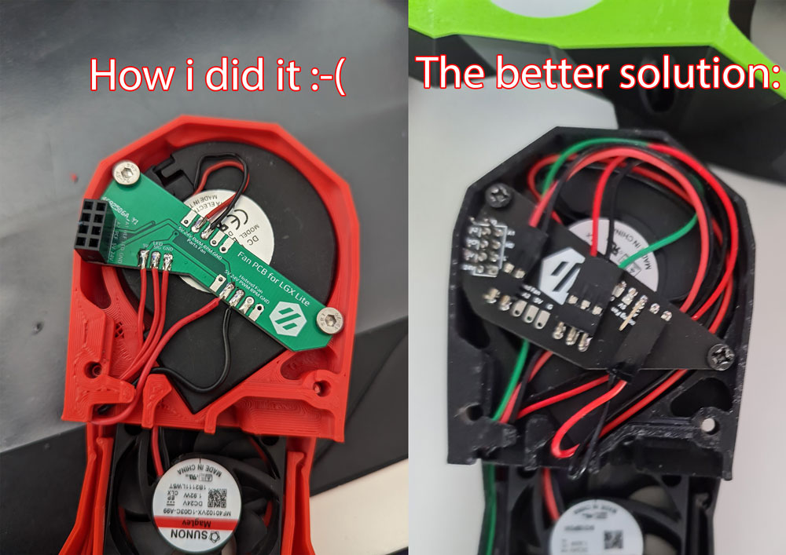
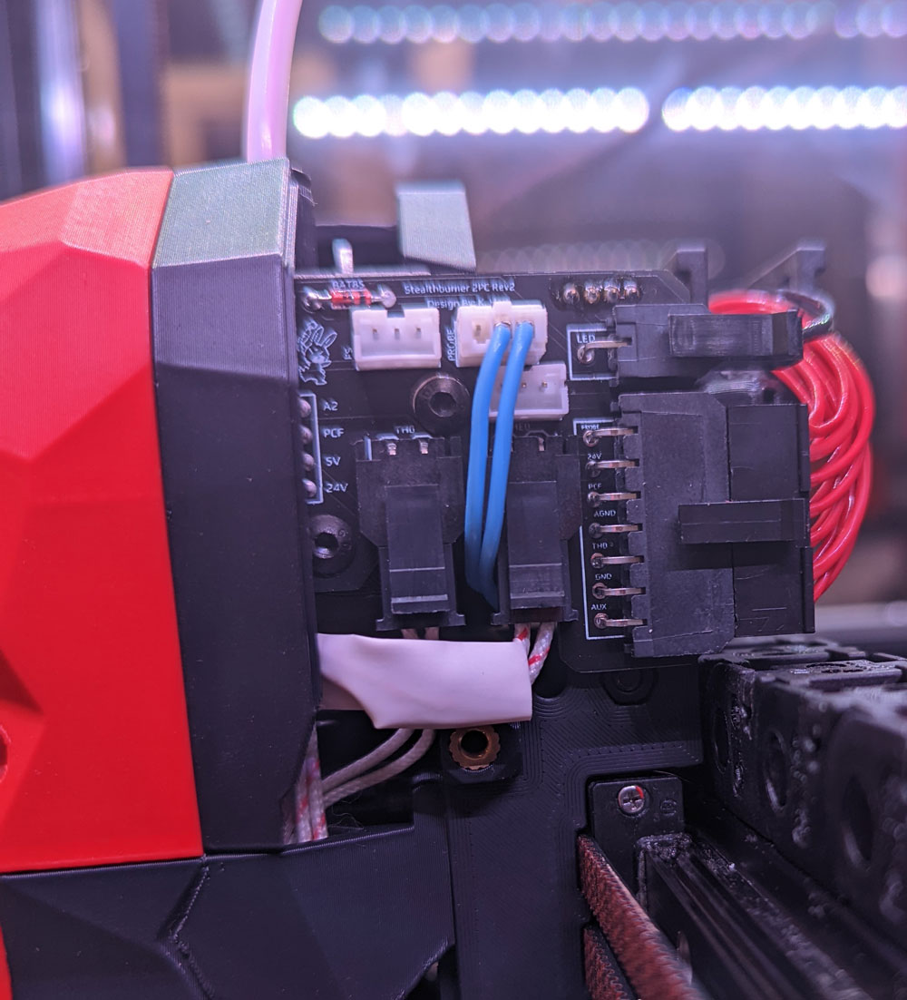

## Changelog:
- 25.07.2022: Cable Cover, First test, please try and report back. It may be a little thin xD 
- 25.07.2022: <a href="./Option_without_LGXlite-FanPCB">New Option without FanPCB</a>. See this as an emergency option, 
this will work with the Standard FanPCB from hartk! 
But at least you can now get the thing running and replace later when you get the Lgx lite FanPCB. 
-Release (24.07.22): Release!

  

    Old Changelog
  

- Nothing yet.

#

#

#

  

    CREDITS: LOGAN!!!, Eytecz, hartk, Voron-Team & all the great people we have in our community :-)
  

* Logan: He modified hartk's Fan-PCB to make this Project working at all! Thanks Logan!!! 
* Eytecz: <a href="https://github.com/Eytecz/LGX_Lite_Stealthburner_CW2_style_mount">Original SB-Lgxlite</a>, he made the work, i modified it only for the 2-Part PCB! 
* hartk: For the beatiful 2-Part PCB :-) 
* Voron-Team: Yeah, without you Guys, nothing were possible here :-) 
* Community: Feelingwise discord is a Place filled with only nice and always helpful People! A special thanks to all of them, i personally just love everyone there! 

  

    Print Settings:
  

- Default Voron settings, correct orientation, no supports needed! 

  

    Where can i get the Fan-PCB from?:
  

- JlcPCB: All you need is the <a href="./PCB">Gerber File</a> 
- Discord: Gi7mo!#4618 -> He has them already on Stock! (Germany/EU) 
- Note: The mainpcb is default hartk, only the fanpcb changed a bit! 

  

    BOM:
  

- 12x M3 Threaded Insert 
- 2x DIN 562 - M3 
- 2x ISO 7380 - M3 x 6 
- 2x DIN 912 - M3 x 5 
- 5x DIN 912 - M3 x 12 
- 3x DIN 912 - M3 x 25 
- 1x DIN 912 - M3 x 20 
- 1x DIN 912 - M3 x 8 
- 1x UM2 4mm Connector 

  

    Description:
  

- This is basically Eytecz LGX-Lite mount, modified for the 2-Part PCB and some other Updates 
- The Pictures should as always be self-explanatory! 
- There are 2 options: CW1 Carriage or CW2 Carriage! I do highly recommend the CW1 Carriage, because on the CW2 the only change are the inserts from the front, because the CW2 extruder needs that. Those inserts will likely fall out after a time! As this is the only change, i highly recommend the CW1 Version! 
- PCB_Mount_Offset_0.6mm and PCB_Mount_Default: Try first the default version, if you issue problems try the "Offset Version", it puts the PCB 0,6mm further back if the connector isnt seamless with the front of the Mount. 
- Optionally for best compatibility, you can print [Optional]_Stealthburner_Body. It is not needed, but it will make fittings minimally better! 
- Its recommended to cut the pins flush on the Hartk PCB! They can or are in most cases too long. 

## Pictures:

